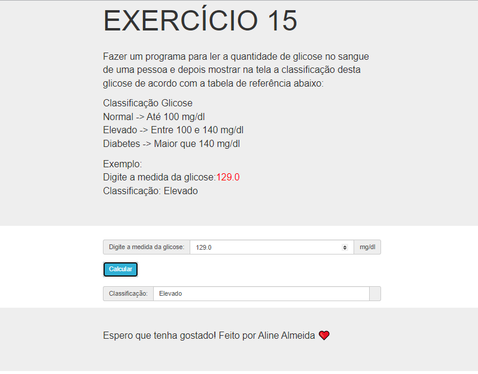

# Jovens Tegranos Exercicio 15

# 🏁 **Tópicos**

 * 👉 Banner
 * 👉 Título e Descrição
 * 👉 Status do Projeto
 * 👉 Funcionalidades
 * 👉 Demonstração da aplicação
 * 👉 Pré-requisitos
 * 👉 Tecnologias utilizadas
 * 👉 Autor
 * 👉 Licença
 
 ____________________________________________________________
# ✅ Banner 👌

<h1 align="center">
  
</h1>

# ✅ Título e Descrição 👌

### Exercicio 15

#### Fazer um programa para ler a quantidade de glicose no sangue de uma pessoa e depois mostrar na tela a classificação desta glicose de acordo com a tabela de referência abaixo:
    Classificação Glicose
    Normal -> Até 100 mg/dl
    Elevado -> Entre 100 e 140 mg/dl
    Diabetes -> Maior que 140 mg/dl

    Exemplo:
    Digite a medida da glicose: 129.0
    Classificação: Elevado   
       

# ✅ Status do Projeto 👌

### 🚧 Projeto 🚀 **Concluído com Sucesso!!!** 👌 🚧

# ✅ Funcionalidades 👌

### - [x] Ler a quantidade de glicose no sangue de uma pessoa.
### - [x] Mostrar na tela a classificação desta glicose de acordo com a tabela de referência.

# ✅ Demonstração da aplicação 👌

<h1 align="center">
  
</h1>

### GitHub AlineAlmeida85

### Link: [Projeto]()

# ✅ Pré-requisitos 👌

### Nenhum, basta clicar no link acima

# ✅ Tecnologias utilizadas ⚒️ 👌

### As seguintes tecnologias foram usadas na construção do projeto:

- [HTML](https://pt.wikipedia.org/wiki/HTML)
- [CSS](https://pt.wikipedia.org/wiki/Cascading_Style_Sheets)
- [JavaScript](https://www.javascript.com/)

# ✅ Autor 👌

### Aline Almeida 💝

# ✅ Licença

### Não Possui

#### Espero que te agrade! ❤️